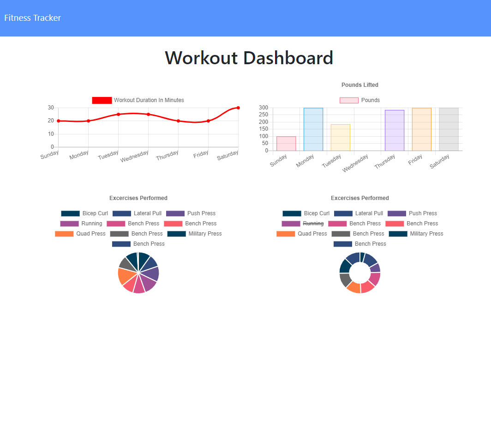
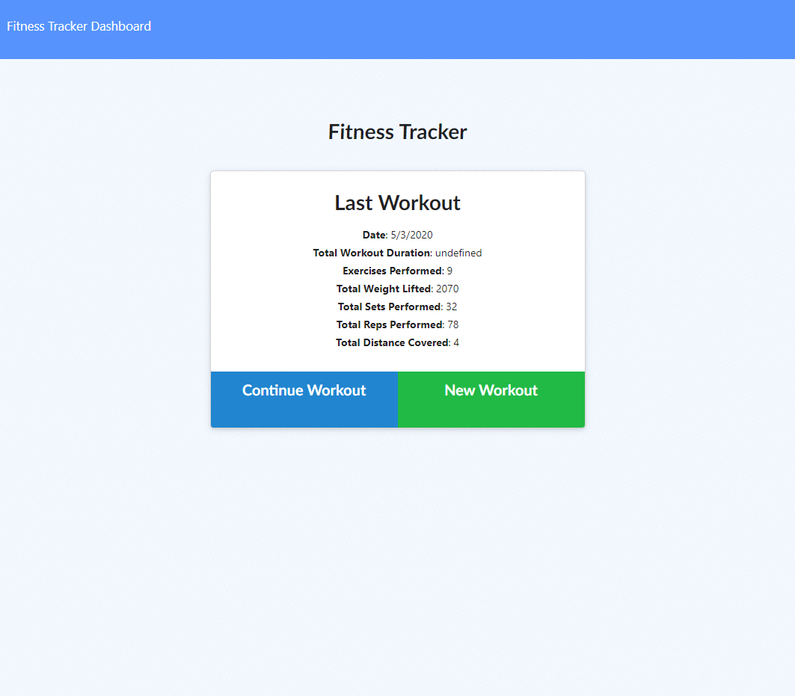

# GT-Homework-14-NoSQL-Workout-Tracker

Fitness Tracker helps consumers reach their fitness goals quicker when they track their workout progress.



## Description

Users can view create and track daily workouts. Users can log multiple exercises in a workout on a given day. Users can track the name, type, weight, sets, reps, and duration of exercise. If the exercise is a cardio exercise, the user should be able to track their distance traveled.

## Table of Contents

* [Installation](#installation)
* [Usage](#usage)
* [Design](#design)
* [Contributing](#contributing)
* [Website](#website)
* [Repository](#repository)
* [Questions](#questions)
* [License](#license)

## Installation

Install the necessary dependencies in the command line with:

```sh
npm install
```
and

```sh
npm run seed
```

## Usage

Option 1) Go to the provided <a href="https://gentle-badlands-62416.herokuapp.com/">link</a> to experience the website or,

Option 2) download and install MongoDB and build your own database to use wth the application. 

Run the application in the command line with:

```sh
node server.js
```

The following demonstrates general application functionality:



## Contributing

None.

## Website

[Deployed Application](https://gentle-badlands-62416.herokuapp.com/)

## Repository

[Github Repository](https://github.com/AlanAshworth/GT-Homework-14-NoSQL-Workout-Tracker)

## Questions


Contact me at <a href="mailto:awashworth927@gmail.com">awashworth927@gmail.com</a>

## License

© 2019 Trilogy Education Services, a 2U, Inc. brand. All Rights Reserved.